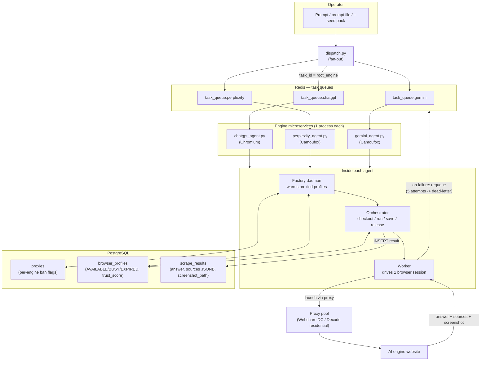

# Traqer Scraper — Complete Project Documentation

A multi-engine AI-answer scraping microservice for **GEO (Generative Engine
Optimization)**. It submits buyer-intent prompts to **ChatGPT, Perplexity, and
Gemini**, then captures each AI's answer, its cited source URLs, and a full-page
screenshot — so a B2B SaaS brand ("Traqer") can track how AI engines answer queries
and which sources they cite.

> **Google AI Overviews is out of scope for this service** — it is owned/handled
> separately by the company (via a third-party SERP API), because Google's `/search`
> endpoint blocks automated browsers regardless of proxy/fingerprint (see §7.2). This
> repo covers the three browser-scrapeable engines only.

---

## 1. What it does (in one paragraph)

You drop a prompt into a dispatcher. The dispatcher fans it out to one Redis queue
per engine. Each engine runs as an independent worker service that checks out a
warmed, proxied browser profile, opens the AI engine, submits the prompt, waits for
the answer to finish, extracts **answer text + source URLs + a screenshot**, and
saves the result to PostgreSQL. All results for one prompt share a `task_id` root so
they can be compared across engines.

---

## 2. Architecture (component map)

Each engine is its own microservice (`<engine>_agent.py`) with four internal parts:

- **Dispatcher (`dispatch.py`)** — pushes one task per engine into Redis.
- **Factory** — a daemon that keeps a pool of warmed, proxied browser profiles ready.
- **Orchestrator** — atomically checks out a profile, runs the worker, saves the
  result, releases the profile.
- **Worker** — drives ONE browser session end-to-end for a single task.

Shared infrastructure: **PostgreSQL** (state: proxies, browser_profiles,
scrape_results) + **Redis** (per-engine task queues + dead-letter queues).

### Browser engine per AI (this matters)

| Engine | Browser | Why |
|--------|---------|-----|
| ChatGPT | **Playwright Chromium** (Chrome fingerprint) | ChatGPT walls anonymous Firefox; Chromium-as-Chrome passes |
| Perplexity | **Camoufox** (anti-detect Firefox) | Works; Cloudflare-fronted |
| Gemini | **Camoufox** | Works well; network-capture for sources |

> Google AI Overviews is **not** in this service (company-owned via SERP API — §7.2).

---

## 3. End-to-end workflow (Mermaid — paste into draw.io)

> draw.io: **Arrange → Insert → Advanced → Mermaid**, then paste the block below.



### Sequence for a single task

```mermaid
sequenceDiagram
    participant D as dispatch.py
    participant R as Redis
    participant Ag as Agent (main loop)
    participant Or as Orchestrator
    participant Wk as Worker (browser)
    participant PG as PostgreSQL

    D->>R: LPUSH task_queue:gemini {task_id, prompt}
    Ag->>R: RPOP task (only if a profile is AVAILABLE)
    Ag->>Or: process_task(task)
    Or->>PG: check_duplicate(prompt)? skip if seen
    Or->>PG: checkout_profile() -> BUSY (FOR UPDATE SKIP LOCKED)
    Or->>Wk: execute_task(prompt) via profile+proxy
    Wk->>Wk: open engine, submit, wait for stream to finish
    Wk-->>Or: {ai_response, sources[], screenshot_path}
    Or->>PG: INSERT scrape_results
    Or->>PG: release_profile(AVAILABLE, trust +1 / on fail EXPIRED, -10)
    Note over Ag,R: on failure -> requeue with attempt counter;<br/>5 attempts -> task_queue:gemini:dead
```

---

## 4. Data model (PostgreSQL)

- **`proxies`** — pool with per-engine ban flags (`chatgpt_banned`,
  `perplexity_banned`, `gemini_banned`). A proxy can be burned on one engine but
  fine on others.
- **`browser_profiles`** — warmed profiles: `status` (AVAILABLE/BUSY/EXPIRED),
  assigned `proxy_string`, `trust_score`, `last_used_at` (TTL is idle-based).
- **`scrape_results`** — `task_id`, `engine_name`, `input_prompt`, `ai_response`,
  `sources` (JSONB array of URLs), `screenshot_path`, `executed_at`.

Correlate one prompt across engines via the shared root: `<root>_chatgpt`,
`<root>_perplexity`, `<root>_gemini`.

---

## 5. Source-capture method per engine

| Engine | How sources are captured |
|--------|--------------------------|
| Perplexity | Opens the "N sources" panel, reads citation links from the DOM |
| Gemini | **Network capture** — reads grounding URLs from the `StreamGenerate` API payload (immune to DOM obfuscation; full article URLs) |
| ChatGPT | Citation links from the open Sources panel (0 when the answer isn't web-grounded) |

> A source only appears when the engine grounded the answer in web search.
> Knowledge-only answers legitimately return zero sources.

---

## 6. Deployment plan

**Target: any Linux host with Docker** (company server recommended — see §7 for why
free tiers don't fit). The stack is portable Docker Compose:

- `postgres` container (schema.sql auto-loaded on first init)
- `redis` container
- 4 agent containers (`python <engine>_agent.py`), each with the browser binaries
  baked in
- `dispatch.py` run as a one-off (`docker compose run --rm ... dispatch.py ...`)

Base image: `mcr.microsoft.com/playwright/python:v1.59.0-jammy` (version-matched to
the `playwright==1.59.0` pin; jammy avoids the Ubuntu-24.04 `libasound2t64` rename;
Chromium + Firefox libs prebaked). Chromium service needs `shm_size: "1g"`.

**RAM budget:** ~400-600 MB per active headless browser. A 2 GB box runs 1-2 agents;
4 GB runs all four comfortably (+ ~150 MB for Postgres/Redis).

**Proxy routing (per-engine, proven):**
- Gemini, Perplexity → free Webshare datacenter proxies (retry dead IPs)
- ChatGPT → residential proxies (Decodo) — datacenter IPs hit its auth wall

> Note: a cloud server's own IP is datacenter-grade (distrusted by Google/ChatGPT),
> so scraping traffic is routed through the residential proxy regardless of where the
> server lives. The server IP does not need to be "clean."

---

## 7. Known issues & limitations (transparent — read before deploying)

These are documented up front so there are no surprises in review or production.

1. **[BLOCKER for Linux/Docker] Windows-only event loop.** All four agents and
   `dispatch.py` end with `asyncio.ProactorEventLoop()`, which is **Windows-only** and
   raises `AttributeError` on Linux. **The containers will not start until this is
   guarded** (`if sys.platform == "win32": ProactorEventLoop else asyncio.run`).
   Trivial, additive fix — Windows behavior unchanged — but MANDATORY for any Docker
   deploy. Not yet applied.

2. **Google AI Overviews is OUT OF SCOPE (company-owned).** It has been removed from
   this codebase. Why it can't be browser-scraped at scale (exhaustively tested):
   Google's `/search` endpoint (which serves both the AI Overview box and AI Mode
   `udm=50`) blocks **automated browsers** via a BotGuard/reCAPTCHA gate that is
   independent of IP, cookies, login, or fingerprint. Camoufox, CloakBrowser (beats
   reCAPTCHA v3), and invisible_playwright all got the "unusual traffic" CAPTCHA —
   even on a trusted home IP. Only `nodriver` (drives real Chrome, non-CDP) passed in
   testing. **The company handles Google AIO separately via a third-party SERP API**
   (SerpApi / DataForSEO expose structured `ai_overview` + `ai_mode` fields). The
   research that led to this handoff is retained for reference:
   `docs/GOOGLE_AIO_ANTIBOT_PLAYBOOK.txt`, `docs/AIO_VERIFICATION.md`,
   `docs/PROXY_PROVIDER_COMPARISON.txt`.

3. **ChatGPT requires residential proxies.** On free Webshare **datacenter** IPs,
   ChatGPT's anonymous gate redirects to login (0/2 in testing). It works on Decodo
   **residential**. Datacenter success on Cloudflare-fronted targets is ~30-50% at
   best. Plan: route ChatGPT through residential IPs.

4. **Perplexity sources are not captured (answer works).** The answer text extracts
   correctly, but the "N sources" citation-panel selector has drifted, so `sources`
   comes back empty. Needs a quick live-DOM inspection to re-find the panel selector.
   Non-blocking; the answer + screenshot are captured.

5. **Sources are legitimately empty for non-grounded answers.** Any engine returns
   zero sources when it answers from its own knowledge (no web search). An empty
   `sources` array is a valid outcome, not a failure.

6. **Playwright is pinned to 1.59.0 — do not upgrade blindly.** 1.60.0 has a Firefox
   driver regression that crashes the whole context on Google Search
   (`pageError.location.url`). Camoufox's dependency is unpinned, so a fresh install
   floats to the broken version; the pin is deliberate.

7. **Free card-free hosting cannot run this.** Genuinely card-free tiers (Render,
   Koyeb) cap at 512 MB RAM and sleep idle containers — a single headless browser
   needs 400-600 MB and the agents must stay always-on. Oracle Cloud Always Free
   (24 GB RAM) fits but requires a card for verification. **Recommendation: deploy on
   the company server** (or any Docker host with ≥2 GB RAM).

8. **Proxy bandwidth is metered on residential.** Residential providers bill per GB;
   a full scrape + screenshot is a few MB. Never leave the factory/agent loop running
   unattended on a metered proxy — it retries on failure and can burn bandwidth fast.

---

## 8. Current status summary

| Engine | Scraping status | Proxy need |
|--------|-----------------|------------|
| Gemini | ✅ Working (answer + sources) | Datacenter OK |
| Perplexity | ✅ Answer working; ⚠️ sources selector to fix | Datacenter OK (retry dead IPs) |
| ChatGPT | ✅ Working | Residential required |
| Google AIO | ➖ Out of scope — company-owned (SERP API) | n/a |

**Deployment:** portable Docker Compose designed; **not yet built**, and the Linux
event-loop fix (§7.1) must land first. Kubernetes manifests deferred to company-infra
scale-up.
